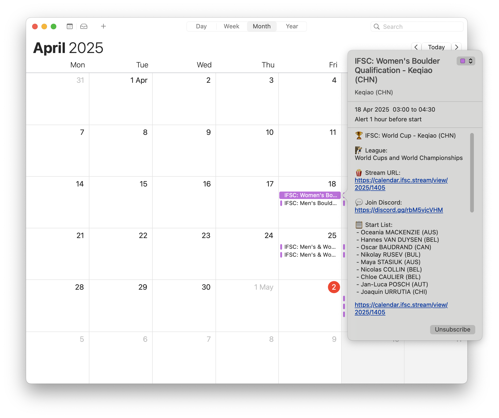

<div align="center">
   <h1>IFSC Climbing Calendar and Live-Streams for 2024</h1>
   

<br /><br />


</div>

<hr />

- [Web version](#-web-version)
- [Intro](#-intro)
- [Usage](#-usage)
    - [Docker](#docker)
    - [Local](#build-app-locally-without-docker)
- [Todo](#-todo)
- [Features](#-features)
- [Requirements](#requirements)

## 📖 TL;DR
This automatically generates an up-to-date calendar you can subscribe to using your favorite calendar app,
to never miss an IFSC climbing event ever again. Currently supported formats are `.ics` (iCal) and `json`.

#### How?
Copy and paste this calendar URL <code>**https://calendar.ifsc.stream**</code> into your calendar subscriptions, and it will
automatically sync with your device. This works on iPhone, Google Calendar, Proton Calendar, etc... This should keep
you updated on future seasons as well.

Take a look at the **[setup guides](https://github.com/sportclimbing/ifsc-calendar/wiki)** for help.

## 🖥️ Web Version

Additionally, the calendar data is exported as `JSON` and can be viewed on this automatically updated
website:

<div align="center">
    <h3>👉 <a href="https://ifsc.stream">https://ifsc.stream</a></h3>
    (From there you can also subscribe to the calendar with just a few clicks!)
</div>

## 👋 Intro
If you're constantly missing IFSC events because of a lacking calendar, or timezone confusions,
then you're at the right place.

This command line tool uses IFSC's APIs, plus some scraping (because the available APIs don't provide precise schedules)
to generate an always up-to-date calendar with all necessary info.

## ⭐️ Features

- Updates automatically every hour
- Fetches schedules directly from IFSC's website (using some APIs and fancy scraping)
- Converts times to your local timezone
- Alerts an hour before events start
- Fetches stream URLs (and searches YouTube for missing ones)
- Works for future seasons once dates are published (may require some tweaks)
- Fetches start list for events
- Works on any calendar (not just Google)
- Fully open source

<div align="center">
    
</div>

## 🛠 Usage

#### Docker

Using the pre-built Docker image
```shell
$ docker run -it --volume "$PWD:/calendar" \
    ghcr.io/sportclimbing/ifsc-calendar:latest \ 
    --season 2024 \
    --league "World Cups and World Championships" \
    --output "/calendar/ifsc-calendar.ics"
```

ℹ️ Note: All Docker images can be [found here](https://github.com/sportclimbing/ifsc-calendar/pkgs/container/ifsc-calendar).

<hr />

#### Build Docker image locally

Build Docker image
```shell
$ docker build --tag ifsc-calendar .
```
Generate `.ics` calendar file
```shell
$ docker run -it --volume "$PWD:/calendar" ifsc-calendar \
    --season 2024 \
    --league "World Cups and World Championships" \
    --output "/calendar/ifsc-calendar.ics"
```

Generate `.json` calendar file
```shell
$ docker run -it --volume "$PWD:/calendar" ifsc-calendar \
    --season 2024 \
    --league "World Cups and World Championships" \
    --output "/calendar/ifsc-calendar.json" \
    --format json
```

Build for multiple leagues
```shell
$ docker run -it --volume "$PWD:/calendar" ifsc-calendar \
    --season 2024 \
    --league "World Cups and World Championships" \
    --league "Games" \
    --league "IFSC Paraclimbing" \
    --output "/calendar/ifsc-calendar.json" \
    --format json
```

Export multiple formats
```shell
$ docker run -it --volume "$PWD:/calendar" ifsc-calendar \
    --season 2024 \
    --league "World Cups and World Championships" \
    --output "/calendar/ifsc-calendar.json" \
    --format json,ics
```

<hr />

#### Build app locally (without Docker)
Build executable
```shell
$ make
```

Generate `.ics` calendar file using the generated `.phar`
```shell
$ ./build/ifsc-calendar.phar \
  --season 2024 \
  --league "World Cups and World Championships" \
  --output "ifsc-calendar.ics"
```

<hr />

### 🔧 Todo
- [ ] Use Symfony serializer to build response object from IFSC API
- [ ] Add BuyMeACoffee link to `.ics` calendar events
- [ ] Add season-specific schedule parsers
- [ ] Calculate average event duration and add it to `events.json` and to the calendar as the official web
  does not tell when an event finishes.
- [ ] Finish writing calendar setup guides
- [ ] Cleanup PHP code
- [ ] Add more tests
- [ ] Make scraping more robust and fail on errors or missing data
- [ ] Fix scraper for older seasons (formatting changes drastically)
- [ ] Add more domain events to improve output log
- [ ] Add automated tests to PRs (unit tests, coverage, etc)
- [x] Show activity and warnings in console (domain events)
- [x] Validate newly generated calendar before publishing site
- [x] Search all YouTube API results (not only the first 50 results)
- [x] Check if there's an API to fetch events from instead of relying on scraping
- [x] Find a way to integrate events not posted on the official event page (e.g. Bern)
- [x] Disable youtube-fetch by default
- [x] Add links to specific events to calendar
- [x] Add `latest` tag to latest release
- [x] Always serve asset from latest release on calendar URL
- [x] Fetch stream links from YouTube API if none can be scraped
- [x] Automatically regenerate calendar and update release

## Requirements
- PHP 8.3
- ext-dom
- ext-libxml

## Legal note
This is in no way affiliated with, or endorsed by the IFSC.